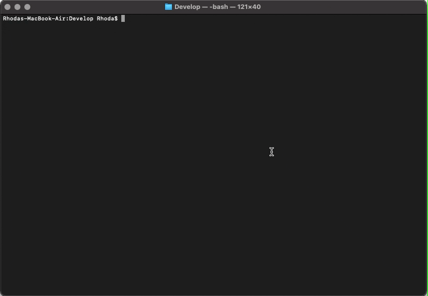
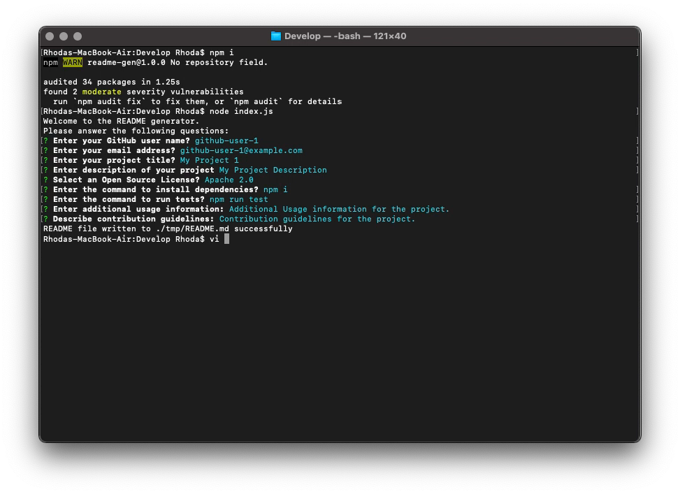
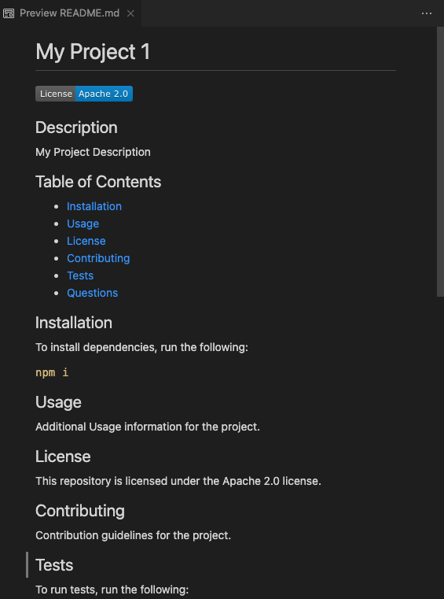

# Professional README Generator

[How to create a Professional README](./readme-guide.md)
## Description

Command line application to generate a professional README file for a repository. The application prompts for the repository and project details and once the details are provided, a README.md file is automatically generated in ./tmp directory.

### Demonstration

View a complete video demonstration of the application: [Professional README Generator Demo](https://www.youtube.com/watch?v=95Te8AvTNcE)

### Output Readme

## Table of Contents

* [Description](#description)
* [Technologies](#technologies)
* [Installation](#installation)
* [Usage](#usage)
* [License](#license)
* [Questions](#questions)

## Technologies

* [Node.js](https://nodejs.org/)
* [Inquirer.js](https://www.npmjs.com/package/inquirer)

## Installation

To install dependencies, run the following:

`
npm i
`

## Usage

After installing the dependencies, run the application with 

`
node index.js
`

## License

This repository is licensed under the [MIT license](./LICENSE).

## Questions

Questions about this repository? Please contact me at [rhoda.evangelene@gmail.com](mailto:rhoda.evangelene@gmail.com). View more of my work in GitHub at [rhodaevangelene](https://github.com/rhodaevangelene) 

